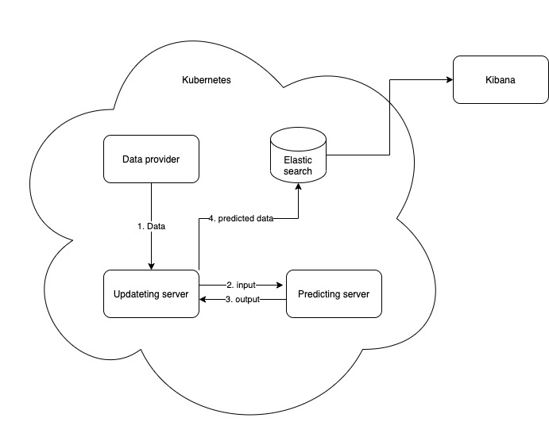

# OVERVIEW


# SOURCE
+ Mongodb:
    + https://viblo.asia/p/cai-dat-mongo-cluster-voi-docker-m68Z0NN25kG
    + https://viblo.asia/p/nhung-dieu-can-biet-ve-mongodb-cluster-oOVlYEmVl8W
#RUN

1. ```cd Elastisearch```
2. ``` docker-compose up```

Elasticsearch: [link](http://localhost:9200/weather_data/_search)

Kibana: [link](http://localhost:5601/)