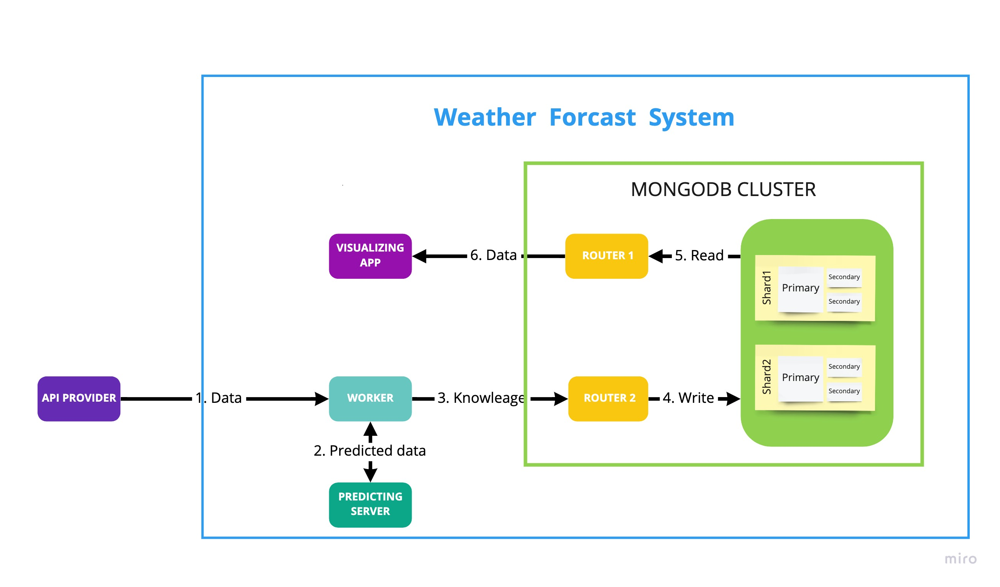

# OVERVIEW


# SOURCE
+ Mongodb:
    + https://viblo.asia/p/cai-dat-mongo-cluster-voi-docker-m68Z0NN25kG
    + https://viblo.asia/p/nhung-dieu-can-biet-ve-mongodb-cluster-oOVlYEmVl8W
#RUN

1. ```cd Mongo```
   
2. ``` docker-compose up```

Open new tab
1. ```docker exec -it mongodb_shard00_1 bash```
2. ```mongo scripts/replicaset_0/init_mongodb_replicaset.js```

Open new tab
1. ```docker exec -it mongodb_shard03_1 bash```
2. ```mongo scripts/replicaset_1/init_mongodb_replicaset.js```

Open new tab
1. ``` docker exec -it mongodb_configsvr0_1  bash```
2. ``` mongo scripts/config_replicaset/init_mongodb_replicaset.js```

Open new tab
1. ```docker exec -it mongodb_router0_1  bash```
2. ``` mongo scripts/sharding_replicaset/init_mongodb_sharding_replicaset.js```

# Save data

1. ```save_to_mongo.py```
Host: localhost

Port: 27017, 27018


# Example

mongodb.py 